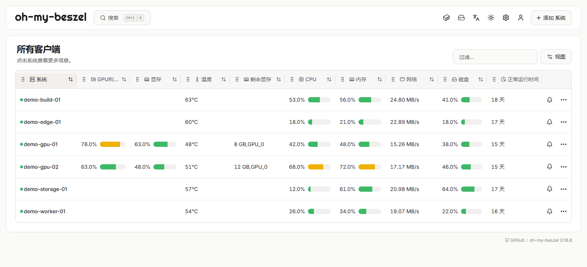
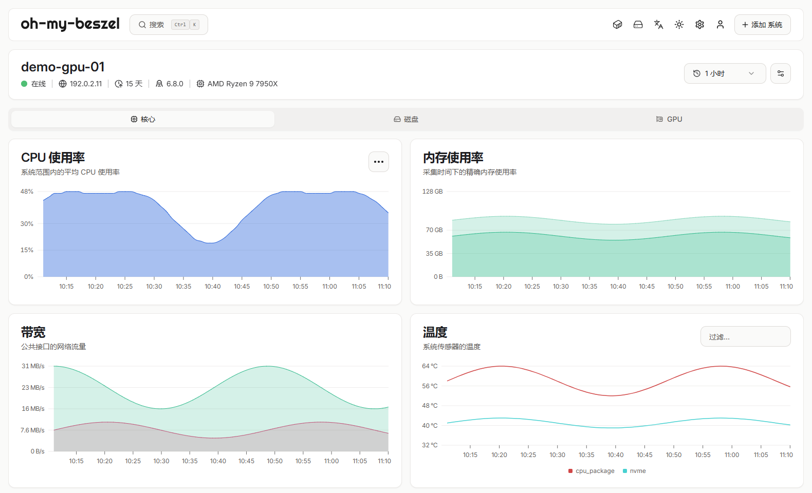
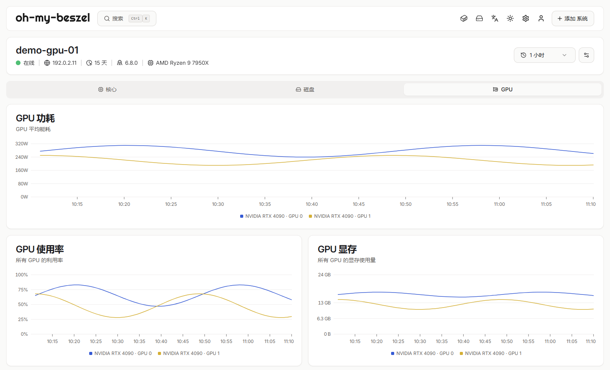
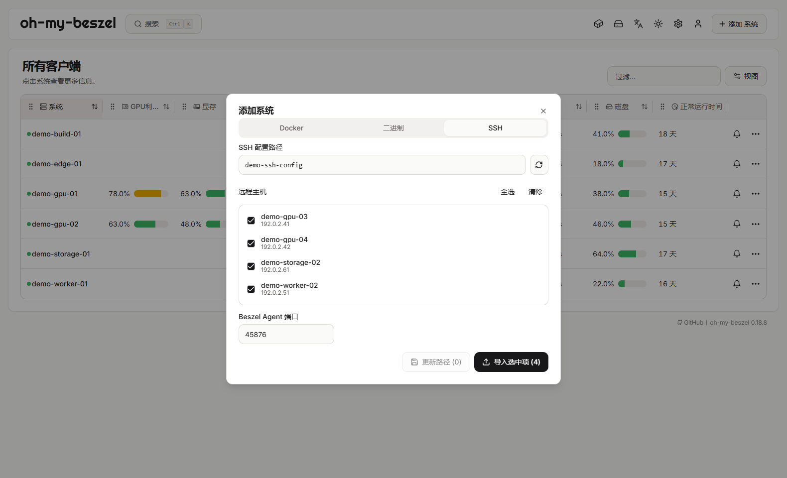
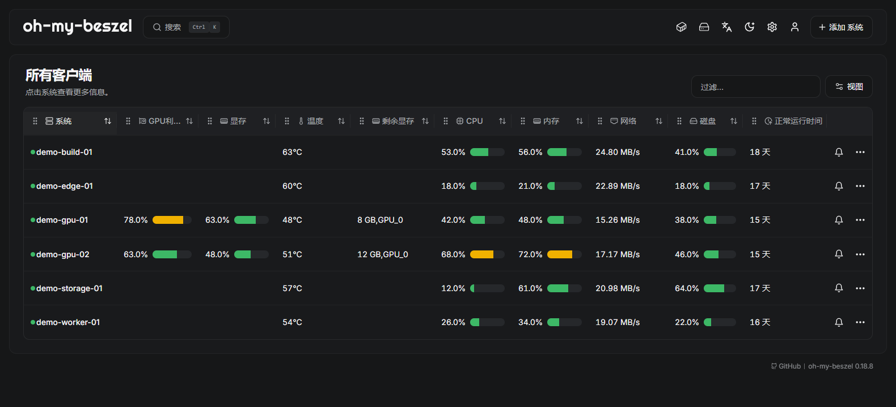
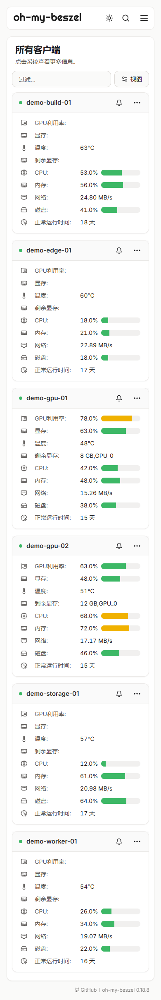

<p align="center">
  
</p>

<h1 align="center">oh-my-beszel</h1>
<p align="center">看清 GPU 集群状态，通过 SSH 轻松管理。</p>
<p align="center"><a href="readme.md">English</a> · <strong>简体中文</strong></p>
<p align="center"><a href="#highlights">核心优势</a> · <a href="#screenshots">页面截图</a> · <a href="#quick-start">快速开始</a> · <a href="docs/guide.zh-CN.md">使用文档</a></p>

面向 GPU 实验室与私有集群的轻量自托管监控。**oh-my-beszel** 将多 GPU 监控、SSH 主机导入和 Agent 部署集中在一个面板中，是基于 [Beszel](https://github.com/henrygd/beszel) 独立维护的非官方分支。

<a id="highlights"></a>

## 核心优势

- 🔍 **最大剩余显存检测。** 检测每台服务器所有 GPU 中的最大剩余显存，持续超过设定阈值时通知，方便发现可用单卡资源。
- 🚀 **批量导入 SSH config。** 沿用 OpenSSH 配置中的主机、跳板机和密钥，批量导入后直接在面板部署 Linux Agent。
- 📊 **多 GPU 监控。** 查看利用率、显存、温度及聚合与单卡历史曲线，配合 CPU I/O 等待和窃取时间告警。
- 🎨 **按习惯定制总览。** 拖动调整列顺序、隐藏不需要的列、切换主题，也能在手机上查看集群。

保留 Beszel 的系统历史、Docker / Podman 监控、多用户、OAuth / OIDC 和备份功能。

<a id="screenshots"></a>

## 页面截图

截图来自隔离演示实例，主机与监控指标均为虚构数据。

**集群总览**



**服务器详情**



<details>
<summary>展开多 GPU 图表、SSH 管理与深色主题</summary>

**多 GPU 历史**



**SSH 主机管理**



**深色总览**



</details>

<details>
<summary>移动端总览</summary>



</details>

<a id="quick-start"></a>

## 快速开始

运行一个 **Hub** 提供面板，在每台被监控节点运行 **Agent**。请使用本仓库构建的程序；上游二进制与镜像不包含本分支增强功能。

**已经有 `build/` 目录？** 该目录不纳入 git，但发布包或此前的构建可能已包含可直接运行的程序。若存在 `build/windows/app/beszel.exe` 和 `build/windows/Monitor.exe`，可跳过下面的构建命令，直接从 `config.json` 配置一步开始。若存在 `build/linux/beszel`，先用 `sha256sum --check build/linux/sha256sums.txt` 校验，再从[ Linux 指南](docs/guide.zh-CN.md#linux)的第 2 步开始。二进制只包含其构建时间之前的改动（见 `build/linux/build-info.txt`）；需要最新代码时按下面的命令重新构建。

**Windows** · 需要 Go 1.26.1+、Bun 和 PowerShell 7。在仓库根目录执行：

```powershell
bun install --cwd ./internal/site --frozen-lockfile
bun run --cwd ./internal/site build
pwsh -NoLogo -NoProfile -File ./deploy/windows/build.ps1
```

编辑 `build/windows/config.json`，设置 `hub.userEmail` 和 `hub.userPassword`，清空 `hub.autoLogin` 以使用密码登录。仅本机访问时保留 `host` 为 `127.0.0.1`。这些凭据用于初始化新数据库；已有账号和继承的自动登录设置见 [Windows 指南](docs/guide.zh-CN.md#windows)。

```powershell
Start-Process -FilePath ./build/windows/Monitor.exe
```

打开 **http://127.0.0.1:8090** 登录。发布包内不含 PowerShell 脚本，也不依赖用户安装的 PowerShell 版本。准备好 Hub 的 SSH 访问后，在 **添加系统 → SSH** 中导入节点。

**修改网页端口：** 编辑实际运行的 `Monitor.exe` 同目录下 `config.json` 的 `port`（例如 `8091`），重启 Hub 后访问 `http://127.0.0.1:8091`。详见[端口与重启步骤](docs/guide.zh-CN.md#web-port)。

**Linux / WSL** · 请参阅[构建与启动指南](docs/guide.zh-CN.md#linux)。

[SSH 部署](docs/guide.zh-CN.md#ssh) · [手动安装 Agent](docs/guide.zh-CN.md#manual-agent) · [Windows 启动器与自动启动](docs/guide.zh-CN.md#windows)

### Agent 用户目录

SSH 自动部署不需要 root 权限，Agent 默认集中安装在一个可整体删除的用户目录：

```text
~/oh-my-beszel/
├── bin/beszel-agent
├── config/env
├── config/hub_keys
├── data/
└── logs/
```

同一个 Agent 可以同时信任多套 Hub；各 Hub 公钥按行保存在 `config/hub_keys`。卸载 SSH 自动部署的 Agent 及其数据时，先停止用户服务，再删除服务链接和整个目录：

```bash
systemctl --user disable --now oh-my-beszel-agent.service 2>/dev/null || true
rm -f "$HOME/.config/systemd/user/oh-my-beszel-agent.service"
rm -rf "$HOME/oh-my-beszel"
systemctl --user daemon-reload 2>/dev/null || true
```

删除 `data/` 会同时删除 Agent 身份。服务与后台运行回退机制详见 [SSH 部署指南](docs/guide.zh-CN.md#ssh)。

## 文档与贡献

- [配置与运维](docs/guide.zh-CN.md) · [故障排查](docs/guide.zh-CN.md#troubleshooting)
- [上游合并说明](docs/upstream-0.19.0.md)：基于 0.18.8，选择性引入 0.19.0 的改动。

欢迎通过 [GitHub](https://github.com/2018liuzhiyuan/oh-my-beszel/issues) 提交问题与 PR。修改配置或行为说明时，请同步更新中英文版本。

## 致谢与许可证

基于 [Beszel](https://github.com/henrygd/beszel) 与 [PocketBase](https://pocketbase.io)，感谢作者与贡献者。[MIT License](LICENSE)。
