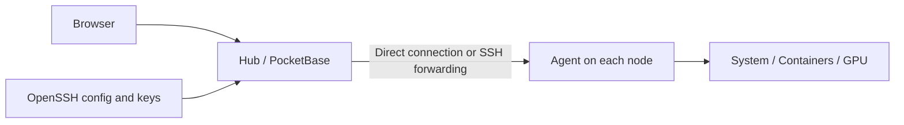

# Setup and operations

[Back to README](../readme.md) · [简体中文](guide.zh-CN.md)

<a id="features"></a>

## Features

| Feature | Behavior |
| --- | --- |
| GPU overview | Utilization, VRAM usage, temperature, and available VRAM in the systems table. |
| Multi-GPU history | Aggregate and per-GPU charts, with stable series identifiers. |
| Available VRAM alerts | Compare the maximum available VRAM across GPUs; trigger after 20 qualifying samples, spaced at least one twentieth of the configured window apart. The first sample is immediate, so the earliest trigger is at 95% of that window. Changing the threshold or window restarts observation. |
| CPU state alerts | Configure I/O wait and steal time thresholds per system or across systems. Agents without usable CPU breakdown data retain their existing alert state. |
| SSH host management | Discover concrete hosts declared in the selected OpenSSH config, following `Include` directives; detect name conflicts, and import in batches. Connections use system OpenSSH for jump hosts and identity files. |
| Agent deployment | Upload and verify Linux amd64 / arm64 binaries over SSH; use systemd or a detached process. Native NVML collection is Linux amd64 with the `glibc` build tag. |
| Hardware information | Linux IPs, NICs, BIOS, BMC and IPMI SEL, subject to hardware, installed tools, and permissions. |
| Customizable overview | Reorder columns with mouse, touch, or keyboard; save visibility and order in the current browser. |
| Alerts and reconnection | Temporarily dismiss active alerts per user in the current browser; retry offline connections after 5 / 10 / 20 / 30 seconds. |

The table's **available VRAM** is the free memory on the GPU with the **largest total VRAM**. The **maximum available VRAM** alert compares **all GPUs**. These are different measurements.

Inherited features include system history, Docker / Podman monitoring, resource and status alerts, multiple users, OAuth / OIDC, backups, S.M.A.R.T., and systemd monitoring.

<a id="architecture"></a>

## What runs where



| Component | Location and purpose |
| --- | --- |
| Hub | One Windows, macOS, or Linux machine. Hosts the web UI, accounts, database, and alerts. |
| Agent | Every monitored node. Collects metrics and communicates with the Hub. |
| OpenSSH config and keys | On the Hub machine, accessible to the account running the Hub. Browser-side files are not used. |

Keep these ports separate: **8090** is the Hub web port, **45876** is the default Agent port, and **22** is the usual operating-system SSH port. SSH forwarding lets the Agent listen only on the node's loopback interface.

<a id="setup"></a>

## Setup

Choose one Hub path: [Windows](#windows), [macOS](#macos), or [Linux / WSL](#linux). Then choose [SSH deployment](#ssh) or [manual Agent setup](#manual-agent). All build commands start in the repository root unless stated otherwise. Clone your own fork first; replace every example address, username, path, and password with your own values.

<a id="prerequisites"></a>

### Build prerequisites

- Go **1.26.1+**, as declared in [go.mod](../go.mod). Existing scripts set `GOEXPERIMENT=nojsonv2` for compatibility with PocketBase on Go 1.27.
- Bun for the frontend; the Linux bootstrap script pins **1.4.0**. Node.js **22.12+** is used by Vite and the npm build path.
- PowerShell **7** for Windows scripts; system **OpenSSH client** for SSH integration. macOS packaging uses the system `shasum`, `tar`, `plutil`, and `launchctl` tools.
- Network access to dependency and toolchain downloads. The Linux script can bootstrap missing supported toolchains with pinned versions and SHA-256 checks.

These are build requirements. Running a prebuilt Hub or Agent does not require Go, Bun, or Node. The Windows launcher still needs PowerShell, and SSH integration still needs OpenSSH.

<a id="windows"></a>

### Windows: configure and start the Hub

**1. Build the portable directory** on Windows 10 / 11 x64. Build the frontend first so the package contains the current UI:

```powershell
bun install --cwd ./internal/site --frozen-lockfile
bun run --cwd ./internal/site build
pwsh -NoLogo -NoProfile -File ./deploy/windows/build.ps1
```

Output: `build/windows/`, including `beszel.exe`, `Monitor.exe`, scripts, `agents/`, and configuration templates. If `config.json` already exists, the build preserves it.

**2. Edit `build/windows/config.json` before the first start.** If it is absent, copy `config.example.json` to `config.json`. The following is a password-login example; replace the placeholder password:

```json
{
  "host": "127.0.0.1",
  "port": 8090,
  "sshConfigPath": "",
  "openBrowser": true,
  "startupTimeoutSeconds": 45,
  "tasks": ["Beszel Hub"],
  "hub": {
    "userEmail": "admin@example.com",
    "userPassword": "REPLACE_WITH_A_UNIQUE_PASSWORD",
    "autoLogin": "",
    "checkUpdates": false
  }
}
```

| Field | What to configure |
| --- | --- |
| `host` / `port` | Keep `127.0.0.1:8090` for local access. This is the Hub web address, not the Agent address. |
| `sshConfigPath` | Leave empty for discovery under the Hub user's home; or set an absolute path such as `C:/Users/operator/.ssh/config`. Forward slashes avoid JSON backslash escaping. |
| `hub.userEmail` / `hub.userPassword` | Create the initial dashboard user and PocketBase superuser when initializing a new database. Editing them later does **not** reset existing accounts. Change existing passwords through account management. |
| `hub.autoLogin` | Empty means normal authentication. An email enables passwordless access as that user for requests reaching the Hub. The shipped template has this enabled; clear it to use password login, especially before making the Hub accessible to others. |
| `tasks` | Scheduled tasks that Monitor starts; keep `["Beszel Hub"]` for the installation below. |
| `openBrowser` / `startupTimeoutSeconds` | Whether Monitor opens the browser, and how long it waits for the Hub to become ready. |
| `hub.checkUpdates` | Retained launcher field, passed as `CHECK_UPDATES`. It is not an installer or an update channel for this fork. |

**3. Start the portable Hub**, then open the dashboard:

```powershell
Start-Process -FilePath ./build/windows/Monitor.exe
```

`Monitor.exe` starts the Hub directly on first use, opens the browser, and registers the task named by `tasks[0]`. The task runs **when the current user logs on**, not before login at machine boot. Open `http://127.0.0.1:8090` and sign in with your configured email and password.

The release package contains no PowerShell scripts and does not depend on an installed PowerShell version. To explicitly install or remove the logon task from any terminal, run:

```text
Monitor.exe install-task
Monitor.exe uninstall-task
```

Configuration changes take effect after restarting the Hub. The native runner uses the values in `config.json` rather than inherited Hub launcher variables. Data is stored in `build/windows/app/beszel_data/`; logs are `build/windows/app/hub.log` and `build/windows/launcher.log`.

<a id="web-port"></a>

#### Change the Windows web port

1. Edit **`config.json` beside the `Monitor.exe` you actually run**. A fresh build uses `build/windows/config.json`; if you deployed the package elsewhere, edit that directory's copy. Change only the top-level `"port": 8090` to an unused port such as `"port": 8091`. Keep `"host": "127.0.0.1"` for local access and preserve the other settings. No rebuild is needed.
2. Double-click `Monitor.exe` again. It stops the Hub process from this package when it is still serving the old port, then starts the same package with the new configuration. Other extracted copies are not stopped.
3. Open `http://127.0.0.1:8091`. Monitor reads the same configuration and opens the new address on its next launch. Update bookmarks and any proxy or tunnel that targets the old web port. Agent port `45876` and operating-system SSH ports do not need to change.

For macOS or Linux / WSL, change both `BESZEL_HTTP` and `APP_URL` (or the equivalent startup command values), then restart that Hub with the same data directory.

<a id="macos"></a>

### macOS: build, run, and start the Hub at login

**1. Build a native portable archive** on macOS. The script builds the current Mac architecture by default and includes Linux amd64/arm64 Agents for SSH deployment:

```bash
./deploy/macos/build.sh dev
```

Use `./deploy/macos/build.sh dev amd64` for Intel, `arm64` for Apple Silicon, or `all` to produce both archives. The output is `build/oh-my-beszel_dev_darwin_<arch>.tar.gz`, with an unpacked staging copy under `build/macos/<arch>/oh-my-beszel-darwin-<arch>/`. Set `SKIP_WEB=1` only when `internal/site/dist/index.html` already contains the UI you intend to ship.

**2. Configure and start the Hub in the foreground:**

```bash
cd build/macos/arm64/oh-my-beszel-darwin-arm64  # use amd64 on Intel
shasum -a 256 -c sha256sums.txt
cp config.env.example config.env
./start.sh
```

Open `http://127.0.0.1:8090` and create the first account. The default data directory is `~/Library/Application Support/oh-my-beszel`; changing `USER_EMAIL` or `USER_PASSWORD` after that database exists does not reset an account. Edit `config.env` to change the listen address, public URL, data directory, SSH config, or optional first-run credentials.

**3. Optional: start the Hub automatically when the current user logs in:**

```bash
./install-service.sh
```

This installs `~/Library/LaunchAgents/com.oh-my-beszel.hub.plist` and starts it with launchd. Logs go to the package's `logs/` directory. Keep the extracted package at a stable path; after moving it, run the installer again. To stop the service and remove the login item while keeping Hub data, run `./uninstall-service.sh`.

The package also contains a native `beszel-agent` for monitoring a Mac. Add the system in the dashboard, copy its Hub public key, and run:

```bash
KEY='<hub public key>' \
LISTEN=127.0.0.1:45876 \
DATA_DIR="$HOME/Library/Application Support/oh-my-beszel-agent" \
./beszel-agent
```

The dashboard's SSH auto-deployment remains for **Linux targets**; the macOS Hub can deploy to them because both Linux Agent architectures are in `agents/`. macOS may quarantine binaries extracted from a downloaded archive. After verifying the release and checksums, clear that package's quarantine with `xattr -dr com.apple.quarantine .` if Gatekeeper blocks it.

<a id="linux"></a>

### Linux / WSL: build and start the Hub

**1. Build the Hub and Agent binaries** (requires Go 1.26.1+ and Bun). Or download the prebuilt Linux archive from the [releases page](https://github.com/2018liuzhiyuan/oh-my-beszel/releases) and skip to step 2.

```bash
bun install --cwd ./internal/site --frozen-lockfile
bun run --cwd ./internal/site build
export GOEXPERIMENT=nojsonv2  # required with Go 1.27+ (PocketBase json/v2 recursion on first-run DB init)
mkdir -p build/linux
CGO_ENABLED=0 go build -trimpath -ldflags '-s -w' -o build/linux/beszel ./internal/cmd/hub
CGO_ENABLED=0 go build -trimpath -ldflags '-s -w' -o build/linux/beszel-agent ./internal/cmd/agent
CGO_ENABLED=0 go build -trimpath -tags glibc -ldflags '-s -w' -o build/linux/beszel-agent-glibc ./internal/cmd/agent
```

The default static Agent covers CPU-only nodes; the `-tags glibc` build dynamically links glibc and is required for NVML (NVIDIA GPU) collection. Linux amd64 was tested on real hardware; arm64 deployment support in the code is not equivalent to an arm64 runtime test.

**2. Start the Hub with an explicit persistent data directory** in a Linux terminal:

```bash
mkdir -p "$HOME/.local/share/oh-my-beszel"
export APP_URL="http://127.0.0.1:8090"
./build/linux/beszel serve --http 127.0.0.1:8090 \
  --dir "$HOME/.local/share/oh-my-beszel"
```

**3. Open `http://127.0.0.1:8090` and create the first account.** This assumes a new data directory and no preconfigured `USER_EMAIL` / `USER_PASSWORD`. Keep this terminal open; Ctrl+C stops the foreground Hub. Use the same `--dir` on every start to retain accounts, keys, and history.

The Linux Hub does **not** read the Windows `config.json`. Configure it using CLI flags and environment variables before starting it:

| Setting | Purpose |
| --- | --- |
| `serve --http` | Listening interface and web port. |
| `--dir` | Persistent Hub data directory; use a fixed path. |
| `APP_URL` | URL users/Agents can use to reach the Hub. It does not change the listening address. |
| `SSH_CONFIG_PATH` | OpenSSH config path on the Hub machine; see [SSH setup](#ssh). |
| `BESZEL_AGENT_DEPLOY_DIR` | Directory containing locally built Agents for SSH deployment. |
| `USER_EMAIL` / `USER_PASSWORD` | Optional initial credentials for a new database; omit to create the first account in the UI. |
| `AUTO_LOGIN` | Omit for normal authentication; setting an email enables passwordless access as that user. |

These shell exports only apply to that process environment. For unattended use, configure a service supervisor with the same executable, account, data path, and environment. This repository does not yet ship a Linux **Hub** systemd installer.

<a id="remote-access"></a>

### Accessing a Hub on another machine

`127.0.0.1` always means the machine making the connection. For a Hub on a remote server, keep the loopback listener and forward it from your computer (replace `hub-server` with your SSH host):

```bash
ssh -N -L 8090:127.0.0.1:8090 hub-server
```

Keep the tunnel open and browse to `http://127.0.0.1:8090` locally. If serving other users over a LAN or reverse proxy, configure the listener/firewall and the external `APP_URL`, use HTTPS at the proxy, and disable auto-login. An Agent on another machine cannot use the Hub's loopback URL for an outbound connection.

<a id="ssh"></a>

## Connect nodes through SSH deployment

Importing an SSH host can **install or replace an Agent on that node**. Hosts with an SSH config and a pending/down status are eligible for automatic deployment, including after Hub startup. Use this path for nodes you intend this Hub to manage.

**1. Prepare OpenSSH on the Hub machine**, under the same account that runs the Hub. Put a concrete alias in its SSH config:

```sshconfig
Host gpu-node-a
    HostName 192.0.2.10
    User operator
    Port 22
    IdentityFile ~/.ssh/id_ed25519
```

`192.0.2.10` is a documentation-only address. Replace it, the username, and the key path. Configure `ProxyJump` if required. Confirm the host fingerprint on your initial SSH connection, then verify noninteractive access. A passphrase-protected key must already be available through an SSH agent accessible to the Hub process:

```bash
ssh -F ~/.ssh/config -o BatchMode=yes gpu-node-a "uname -s; uname -m"
ssh -F ~/.ssh/config -o BatchMode=yes gpu-node-a 'test -n "$HOME" && test -w "$HOME"'
```

The target must be Linux amd64 or arm64, and the SSH account needs a writable home directory. Deployment never requires root or sudo. Normal password-based SSH login is still insufficient for the background deployment process because the Hub invokes SSH in batch mode.

**2. Point the Hub to this config.** On Windows, set `sshConfigPath` in the package's `config.json`. On macOS, set `SSH_CONFIG_PATH` in `config.env`. On Linux, export it before restarting the Hub:

```bash
export SSH_CONFIG_PATH="$HOME/.ssh/config"
```

**3. Prepare the matching Agent artifact on the Hub.** Windows and macOS packages already contain `agents/beszel-agent_linux_amd64` and `agents/beszel-agent_linux_arm64`. For a Linux amd64 build, prepare the directory explicitly:

```bash
mkdir -p ./build/linux/agents
cp ./build/linux/beszel-agent ./build/linux/agents/beszel-agent_linux_amd64
export BESZEL_AGENT_DEPLOY_DIR="$(pwd)/build/linux/agents"
```

For Linux amd64 NVIDIA nodes with glibc and the NVIDIA driver/NVML library, replace that artifact with the NVML build before deployment:

```bash
cp ./build/linux/beszel-agent-glibc ./build/linux/agents/beszel-agent_linux_amd64
```

Artifact lookup order is `BESZEL_AGENT_DEPLOY_DIR`, `agents/` beside the Hub executable, then `agents/` inside the Hub data directory. Filenames must be exactly `beszel-agent_linux_amd64` or `beszel-agent_linux_arm64`, matching the target. Renaming an amd64 binary does not make it an arm64 binary. The deployment code does not select a separate `_glibc` filename automatically.

**4. In the dashboard, open Add System → SSH.** Check the displayed config path and reload after changing it. Hosts pulled in through `Include` are listed too; relative include paths resolve against the including file, as in OpenSSH. Select hosts, keep Agent port `45876` unless you need another, then import. This field is **not** the operating-system SSH port. A read-only account cannot manage these settings. The quick-add field on the Binary tab uses the same discovery and stores the **alias** with the config path, so jump-host aliases connect through `ssh -W` and deploy automatically.

The Hub uploads the local artifact, verifies SHA-256, and installs it under `~/oh-my-beszel/` with `bin/`, `config/`, `data/`, and `logs/` subdirectories. It never writes to `/opt`. When a user systemd manager is available it enables and starts `oh-my-beszel-agent.service`; otherwise it starts a detached process, without a reboot-start guarantee. The Agent listens on `127.0.0.1:45876` by default for this path, and the Hub connects through `ssh -W`. Allow SSH TCP forwarding on the node; the Agent port need not be exposed publicly. Each Hub public key is appended once to `config/hub_keys`, so multiple Hubs can use the same Agent. Deployment is skipped only when the binary matches, the port is listening, the Agent is healthy, and the current Hub key is already authorized.

An Agent port belongs to the whole target host, even when several operating-system users share that host. If another user's Agent or a system service already listens on `45876`, choose a different free Agent port when importing this system. Auto-deployment stops only the current SSH account's managed Agent; if the requested port remains occupied, it reports the conflict instead of mistaking the foreign listener for a successful deployment.

**5. Confirm the node becomes online** and CPU/memory charts update. On the node, check the service and Agent health as needed:

```bash
systemctl --user status oh-my-beszel-agent.service --no-pager
LISTEN=127.0.0.1:45876 "$HOME/oh-my-beszel/bin/beszel-agent" health
```

The `systemctl --user` command applies only when the account has a running user systemd manager. Enabling linger for that account is recommended when the Agent must start after reboot without an interactive login. For NVIDIA nodes, also check `nvidia-smi` on the node and verify GPU count and VRAM capacity in the dashboard.

If a terminal can `ssh <alias>` but the node never becomes online, check three things. The Hub and the deployment both run the system `ssh` in **batch mode**, so every hop — including a `ProxyJump` bastion — must authenticate without a password prompt; the final account must have a writable home directory. The Agent must actually be running on the node (deployment failures leave the system `down`). The failure reason is stored on the system: hover the status indicator or open the system page to read it, admin users also find recent events under **Settings → Hub Logs**, and the same errors are mirrored to `hub.log` (`System down` entries include the ssh helper's stderr; skipped or failed deployments appear as `Agent auto-deploy ...` warnings with the host name). Status-change notifications include the reason as well.

<a id="manual-agent"></a>

## Manual Agent setup with a direct connection

Use this path when you want to manage Agent installation yourself. The example is a **Hub → Agent** connection over a private network, with no SSH config attached to the system.

1. Copy a matching Agent built from this repository to the monitored node. For Linux amd64 use `build/linux/beszel-agent`, or `beszel-agent-glibc` for native NVML on supported NVIDIA nodes, and name the copied file `beszel-agent`. On macOS use the `beszel-agent` from the matching `darwin_arm64` or `darwin_amd64` package.
2. In **Add System → Binary**, enter a name, the node's reachable **IP address**, and Agent port `45876`. Copy the **Hub public key** shown in the form and save the system. This public key is different from your operating-system SSH private key.
3. On the monitored node, replace the public-key placeholder below and run from the directory containing the Agent:

```bash
chmod +x ./beszel-agent
mkdir -p "$HOME/.local/share/oh-my-beszel-agent"
export DATA_DIR="$HOME/.local/share/oh-my-beszel-agent"
export LISTEN="0.0.0.0:45876"
export KEY="REPLACE_WITH_HUB_PUBLIC_KEY"
./beszel-agent
```

Restrict access to port `45876` to the Hub in the node's firewall, or bind `LISTEN` to a private interface. Keep the terminal open for this trial; configure your service manager for persistent operation. `KEY_FILE` can be used instead of `KEY` to read the Hub public key from a file.

`TOKEN` and `HUB_URL` are used for an Agent-initiated connection; they are not needed for the direct Hub-initiated example above. If using that alternative, take the token from the matching system in the dashboard and ensure `HUB_URL` is reachable **from the node**, rather than copying an inaccessible localhost URL.

The UI's inherited “Copy Linux command” and Docker buttons still reference upstream installation scripts/images. To run this fork's Agent changes, use the local binaries above or SSH deployment instead of assuming those buttons install this fork.

<a id="operations"></a>

## System page addresses

System links use the display name, for example `/system/16.7` or `/system/Pro6000_2`. Case, letters, numbers, dots, underscores, and hyphens are preserved; Unicode is normalized and spaces or URL delimiters become hyphens. Browsers encode non-ASCII characters when needed.

Names that collide after conversion, match a record ID, or exceed 80 Unicode characters receive a `~recordID` suffix; long names keep their first 80 characters. Empty or purely unsupported names use `system~recordID`. Existing record-ID links and addresses ending in `~recordID` still work after renames or collision changes and redirect to the current name. Renaming a system changes its name-based address, so use the record-ID address for a bookmark that must survive future renames.

## Data, restart, and upgrades

| Item | Location / action |
| --- | --- |
| Windows Hub data | `app/beszel_data/` inside the portable directory. |
| macOS Hub data | `~/Library/Application Support/oh-my-beszel` by default, or `BESZEL_DATA_DIR` from `config.env`. |
| Linux Hub data | The directory passed to `--dir`; without it, the default is `beszel_data` relative to the working directory. |
| Manual Agent data | The `DATA_DIR` used above. Retain it to preserve Agent identity. |
| SSH-installed Agent | `~/oh-my-beszel/`; configuration and Hub keys are under `config/`, identity under `data/`, and logs under `logs/`. |
| Windows restart | After editing `config.json`, run `Monitor.exe` again; it restarts this package when required. |
| macOS restart | After editing `config.env`, run `launchctl kickstart -k gui/$(id -u)/com.oh-my-beszel.hub`, or stop and rerun `start.sh` in foreground mode. |
| Backup / migration | Stop the Hub before a filesystem copy of its complete data directory; also preserve your configuration and SSH setup. |
| Upgrade | Back up, stop the old process, replace it with this fork's new binary/package, then start with the same data directory and verify nodes. Do not overwrite your local config with the example. |

Running `Monitor.exe uninstall-task` unregisters the Windows task; it does not delete data or guarantee the running Hub has stopped. Before moving or deleting a package, stop its specific running instance.

Keep real passwords, tokens, SSH private keys, databases, and logs outside Git. The repository already ignores build directories and test evidence.

<a id="troubleshooting"></a>

## Troubleshooting

| Symptom | Check |
| --- | --- |
| Monitor fails on the first start | Check `launcher.log` and `app/hub.log`, verify `app/beszel.exe` exists, and choose an unused port. |
| macOS Hub does not start | Check `logs/hub-error.log`, validate `config.env` with `sh -n`, confirm the archive matches the Mac architecture, and inspect `launchctl print gui/$(id -u)/com.oh-my-beszel.hub`. |
| Login ignores the password / changing JSON password has no effect | Clear auto-login and inherited auto-login variables, restart the Hub; use account management for existing passwords. |
| Remote browser cannot open the Hub | Loopback is local to each machine. Use the SSH tunnel above, or configure the listener and firewall for remote access. |
| No SSH hosts appear | Check the path **on the Hub**, read permissions for its service account, concrete `Host` aliases, and reload after path changes. |
| SSH works interactively but deployment fails | Test `BatchMode=yes` as the Hub account; verify key/SSH-agent access and that the target account has a writable home directory. |
| Agent artifact not found / wrong executable format | Check the lookup directories, exact filename, and actual binary architecture. |
| Authentication fails immediately after SSH deployment | Check whether another user or system Agent already owns that Agent port; assign this system a different free port and redeploy. |
| Imported node stays pending/down | Check Hub deployment logs, Agent service health, port consistency, and SSH TCP forwarding. |
| Manual node stays offline | Verify node IP, firewall, `LISTEN`, and that `KEY` is the public key of this Hub. |
| GPU data is missing | Verify `nvidia-smi`, driver permissions, binary choice, and NVML availability for the glibc build. |
| Accounts/history seem lost after restart | Check that the same Hub data directory and running account are in use. |

<a id="development"></a>

## Development and verification

From the repository root, Go checks are `go vet -tags=testing ./...` and `go test -tags=testing ./...` (the `testing` build tag enables test-only helpers). Inside `internal/site`, frontend checks are `bun test`, `bun x tsc --build`, and `bun x biome lint src vite.config.ts`.

Cross-compilation is not a runtime test. The stricter local harness that orchestrates these checks plus race, fuzz, performance budgets, browser, and live-GPU tests is kept outside the published tree.


<a id="layout"></a>

## Repository layout

```text
agent/
internal/hub/
internal/alerts/
internal/site/
internal/cmd/
deploy/windows/
deploy/macos/
docs/assets/
```

These contain node collection, Hub APIs/deployment, alerts, frontend, executable entry points, Windows/macOS packaging, and branding assets respectively.

<a id="publishing"></a>

## Naming and publishing

The project/repository name is **oh-my-beszel**. The Go module `github.com/henrygd/beszel`, binary names `beszel` / `beszel-agent`, environment variables, and data directory conventions remain compatible. This does not imply an upstream release.

GoReleaser is configured for binary archives and a draft Release, without publishing to upstream Homebrew, Scoop, or WinGet repositories. Set Git remote to your own repository and validate the frontend and target platforms before publishing.

Before committing, inspect the files Git will include:

```powershell
git status --short
git ls-files -ci --exclude-standard
git diff --check
git diff --cached --check
```

The second command should produce no output. Commit source, examples, and tests; retain local configuration, credentials, runtime data, and generated evidence locally.

The English and Simplified Chinese READMEs have matching sections, commands, examples, and configuration semantics. Update both in the same change when behavior or setup instructions change.

<a id="license"></a>

## Credits and license

Thanks to [Beszel](https://github.com/henrygd/beszel), its contributors, PocketBase, and the open-source dependencies used here. [Upstream documentation](https://beszel.dev) covers general Beszel usage; fork-specific deployment behavior is documented above.

Licensed under [MIT](../LICENSE), retaining upstream copyright notices. The all-seeing-eye logo was made with the built-in image generation tool; its prompt is recorded in [brand assets](assets/README.md) (Chinese).
