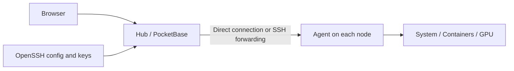

# 配置与运维指南

[返回首页](../README-CN.md) · [English](guide.md)

<a id="features"></a>

## 功能

| 功能 | 行为 |
| --- | --- |
| GPU 总览 | 在系统表查看利用率、显存占用、温度和剩余显存。 |
| 多卡历史 | 提供聚合及单卡图表，使用稳定的序列标识区分 GPU。 |
| 剩余显存告警 | 比较全部 GPU 中的最大剩余显存；连续 20 次采样高于阈值时触发，采样间隔至少为配置窗口的 1/20。首次立即采样，因此最早在窗口的 95% 处触发。修改阈值或窗口会重新开始观察。 |
| CPU 状态告警 | 按单机或跨系统配置 I/O 等待、CPU 窃取时间阈值。Agent 缺少有效 CPU 分项数据时保留原告警状态。 |
| SSH 主机管理 | 发现所选 OpenSSH config 中声明的具体主机，跟随 `Include` 展开；检测名称冲突并批量导入。连接时由系统 OpenSSH 处理跳板机和密钥文件。 |
| Agent 部署 | 经 SSH 上传并校验 Linux amd64 / arm64 程序，使用 systemd 或独立后台进程运行。原生 NVML 采集适用于带 `glibc` 构建标签的 Linux amd64 程序。 |
| 硬件信息 | 显示 Linux IP、网卡、BIOS、BMC 和 IPMI SEL，取决于硬件、已安装工具及权限。 |
| 自定义总览 | 使用鼠标、触摸或键盘调整列顺序；可见列和顺序保存在当前浏览器。 |
| 告警与重连 | 按用户在当前浏览器暂时忽略活跃告警；离线连接按 5 / 10 / 20 / 30 秒重试。 |

系统表的**剩余显存**是**总显存最大的 GPU** 的当前可用量；**最大剩余显存**告警则比较**全部 GPU**。这两个指标的口径不同。

同时保留系统历史、Docker / Podman 监控、资源与状态告警、多用户、OAuth / OIDC、备份、S.M.A.R.T. 和 systemd 监控等上游功能。

<a id="architecture"></a>

## 各部分运行在哪里



| 组件 | 位置与职责 |
| --- | --- |
| Hub | 一台 Windows 或 Linux 机器，提供网页、账号、数据库和告警。 |
| Agent | 每台被监控节点，采集指标并与 Hub 通信。 |
| OpenSSH config 与密钥 | 位于 Hub 机器，由运行 Hub 的账号读取；不会读取浏览器所在机器的文件。 |

注意区分端口：**8090** 是 Hub 网页端口，**45876** 是默认 Agent 端口，**22** 通常是操作系统 SSH 端口。使用 SSH 转发时，Agent 可以只监听节点的回环地址。

<a id="setup"></a>

## 配置与启动

先选择一种 Hub 部署方式：[Windows](#windows) 或 [Linux / WSL](#linux)；再选择 [SSH 自动部署](#ssh) 或[手动配置 Agent](#manual-agent)。除非另有说明，构建命令均从仓库根目录执行。请先克隆自己的分支，并将示例地址、用户名、路径和密码替换为实际值。

<a id="prerequisites"></a>

### 构建前准备

- [go.mod](../go.mod) 要求 Go **1.26.1+**。现有脚本设置 `GOEXPERIMENT=nojsonv2`，用于兼容 Go 1.27 下的 PocketBase。
- 前端使用 Bun；Linux 引导脚本固定为 **1.4.0**。Vite 与 npm 构建路径使用 Node.js **22.12+**。
- Windows 脚本使用 PowerShell **7**；SSH 集成需要系统 **OpenSSH 客户端**。
- 能访问依赖和工具链下载地址。Linux 脚本可自动下载缺失的受支持工具链，并校验固定版本的 SHA-256。

以上属于构建依赖。运行已构建的 Hub 或 Agent 不需要 Go、Bun、Node；Windows 启动器仍需要 PowerShell，SSH 集成仍需要 OpenSSH。

<a id="windows"></a>

### Windows：配置并启动 Hub

**1. 在 Windows 10 / 11 x64 上构建便携目录。** 先构建前端，确保打包的是当前界面：

```powershell
bun install --cwd ./internal/site --frozen-lockfile
bun run --cwd ./internal/site build
pwsh -NoLogo -NoProfile -File ./deploy/windows/build.ps1
```

产物位于 `build/windows/`，包含 `beszel.exe`、`Monitor.exe`、脚本、`agents/` 和配置模板。已有的 `config.json` 会在构建时保留。

**2. 首次启动前编辑 `build/windows/config.json`。** 若不存在，先将 `config.example.json` 复制为 `config.json`。下面是使用密码登录的示例，请替换占位密码：

```json
{
  "host": "127.0.0.1",
  "port": 8090,
  "sshConfigPath": "",
  "openBrowser": true,
  "startupTimeoutSeconds": 45,
  "tasks": ["Beszel Hub"],
  "hub": {
    "userEmail": "admin@example.com",
    "userPassword": "REPLACE_WITH_A_UNIQUE_PASSWORD",
    "autoLogin": "",
    "checkUpdates": false
  }
}
```

| 字段 | 配置方式 |
| --- | --- |
| `host` / `port` | 本机访问保持 `127.0.0.1:8090`。这是 Hub 网页地址，不是 Agent 地址。 |
| `sshConfigPath` | 留空会从 Hub 运行账号的主目录查找；也可填写绝对路径，例如 `C:/Users/operator/.ssh/config`。使用正斜杠可避免 JSON 反斜杠转义。 |
| `hub.userEmail` / `hub.userPassword` | 初始化新数据库时创建初始面板用户和 PocketBase 超级用户。之后修改这两个字段**不会**重置已有账号，请通过账号管理修改已有密码。 |
| `hub.autoLogin` | 留空表示正常认证；填写邮箱后，到达 Hub 的请求可免密码以该用户身份访问。随包模板默认开启了此项；要使用密码登录请清空，尤其不要带着免登录配置开放给其他人访问。 |
| `tasks` | Monitor 要启动的计划任务；按下文安装时保持 `["Beszel Hub"]`。 |
| `openBrowser` / `startupTimeoutSeconds` | 控制 Monitor 是否打开浏览器，以及等待 Hub 就绪的秒数。 |
| `hub.checkUpdates` | 保留的启动器字段，会传为 `CHECK_UPDATES`；它不是本分支的安装器或更新渠道。 |

**3. 启动便携 Hub，然后打开面板：**

```powershell
Start-Process -FilePath ./build/windows/Monitor.exe
```

`Monitor.exe` 首次运行时会直接启动 Hub、打开浏览器，并注册 `tasks[0]` 指定的计划任务。任务会在**当前用户登录时**运行，并非机器开机但尚未登录时运行。访问 `http://127.0.0.1:8090`，使用配置的邮箱和密码登录。

发布包不含 PowerShell 脚本，也不依赖用户安装的 PowerShell 版本。需要显式安装或删除登录任务时，可在任意终端运行：

```text
Monitor.exe install-task
Monitor.exe uninstall-task
```

修改配置后需重启 Hub 才会生效。原生启动器以 `config.json` 为准，不继承旧的 Hub 启动变量。数据保存在 `build/windows/app/beszel_data/`，日志为 `build/windows/app/hub.log` 和 `build/windows/launcher.log`。

<a id="web-port"></a>

#### 修改 Windows 网页端口

1. 编辑**实际运行的 `Monitor.exe` 同目录下的 `config.json`**。新构建的文件在 `build/windows/config.json`；如果已部署到其他目录，应修改部署目录里的那份。将顶层的 `"port": 8090` 改为未占用的端口，例如 `"port": 8091`。仅本机访问时保留 `"host": "127.0.0.1"`，其他配置保持原样，无需重新编译。
2. 再次双击 `Monitor.exe`。若当前包仍在旧端口运行，它会只停止当前包的 Hub，再按新配置启动；不会停止其他解压目录中的实例。
3. 访问 `http://127.0.0.1:8091`。Monitor 下次启动会读取同一份配置并打开新地址。同步更新书签及指向旧网页端口的代理或隧道；Agent 的 `45876` 和操作系统 SSH 端口无需修改。

Linux / WSL 则在启动命令或服务配置中同步修改 `serve --http 127.0.0.1:8091` 和 `APP_URL=http://127.0.0.1:8091`，使用原数据目录重启该 Hub。

<a id="linux"></a>

### Linux / WSL：构建并启动 Hub

**1. 构建 Hub 与 Agent 二进制**（需要 Go 1.26.1+ 和 Bun）。也可以从 [Releases 页面](https://github.com/2018liuzhiyuan/oh-my-beszel/releases) 下载预编译的 Linux 压缩包，直接进入第 2 步。

```bash
bun install --cwd ./internal/site --frozen-lockfile
bun run --cwd ./internal/site build
export GOEXPERIMENT=nojsonv2  # Go 1.27+ 必需（PocketBase 首次建库的 json/v2 递归问题）
mkdir -p build/linux
CGO_ENABLED=0 go build -trimpath -ldflags '-s -w' -o build/linux/beszel ./internal/cmd/hub
CGO_ENABLED=0 go build -trimpath -ldflags '-s -w' -o build/linux/beszel-agent ./internal/cmd/agent
CGO_ENABLED=0 go build -trimpath -tags glibc -ldflags '-s -w' -o build/linux/beszel-agent-glibc ./internal/cmd/agent
```

默认静态版 Agent 适用于无 GPU 节点；`-tags glibc` 版本动态链接 glibc，是 NVML（NVIDIA GPU）采集所必需的。Linux amd64 已在真实硬件上测试；代码支持 arm64 部署不等于已完成 arm64 实机测试。

**2. 在 Linux 终端启动 Hub，并明确指定持久数据目录：**

```bash
mkdir -p "$HOME/.local/share/oh-my-beszel"
export APP_URL="http://127.0.0.1:8090"
./build/linux/beszel serve --http 127.0.0.1:8090 \
  --dir "$HOME/.local/share/oh-my-beszel"
```

**3. 打开 `http://127.0.0.1:8090` 并创建首个账号。** 这里假定使用新数据目录，且没有预先设置 `USER_EMAIL` / `USER_PASSWORD`。保持终端开启，Ctrl+C 会停止前台 Hub。每次启动使用相同的 `--dir`，才能保留账号、密钥与历史数据。

Linux Hub **不读取** Windows 的 `config.json`，请在启动前使用命令行参数和环境变量配置：

| 配置项 | 用途 |
| --- | --- |
| `serve --http` | 监听网卡地址与网页端口。 |
| `--dir` | Hub 持久数据目录，应使用固定路径。 |
| `APP_URL` | 用户或 Agent 能访问到的 Hub URL；不会改变监听地址。 |
| `SSH_CONFIG_PATH` | Hub 机器上的 OpenSSH config 路径，见 [SSH 配置](#ssh)。 |
| `BESZEL_AGENT_DEPLOY_DIR` | 存放本地构建 Agent、用于 SSH 自动部署的目录。 |
| `USER_EMAIL` / `USER_PASSWORD` | 可选，用于新数据库的初始账号；不设置则在网页创建首个账号。 |
| `AUTO_LOGIN` | 正常认证时不设置；填写邮箱会启用以该用户身份免密码访问。 |

这些 shell 环境变量只对相应进程环境生效。需要无人值守运行时，应在服务管理器中配置相同的程序路径、运行账号、数据目录和环境变量。本仓库尚未提供 Linux **Hub** 的 systemd 安装器。

<a id="remote-access"></a>

### 访问另一台机器上的 Hub

连接中的 `127.0.0.1` 始终指发起连接的机器。如果 Hub 位于远端服务器，可以保留回环监听，从自己的电脑建立转发（将 `hub-server` 替换为实际 SSH 主机）：

```bash
ssh -N -L 8090:127.0.0.1:8090 hub-server
```

保持隧道开启，在本机浏览器访问 `http://127.0.0.1:8090`。如果通过局域网或反向代理提供给其他用户，需要配置监听地址、防火墙和对外的 `APP_URL`，在代理处使用 HTTPS，并关闭免登录。另一台机器上的 Agent 不能用 Hub 的回环 URL 发起到 Hub 的出站连接。

<a id="ssh"></a>

## 通过 SSH 自动部署接入节点

导入 SSH 主机可能会**在节点上安装或替换 Agent**。配置了 SSH config 且状态为 pending/down 的主机会进入自动部署流程，包括 Hub 启动后。请将这条路径用于你打算交由此 Hub 管理的节点。

**1. 在 Hub 机器上，以运行 Hub 的同一个账号准备 OpenSSH。** 在 SSH config 中添加具体主机别名：

```sshconfig
Host gpu-node-a
    HostName 192.0.2.10
    User operator
    Port 22
    IdentityFile ~/.ssh/id_ed25519
```

`192.0.2.10` 是文档专用示例地址，请替换它、用户名和密钥路径；需要跳板机时配置 `ProxyJump`。首次 SSH 连接时核对主机指纹，再验证免交互访问。带口令的私钥必须已加载到 Hub 进程可访问的 SSH agent 中：

```bash
ssh -F ~/.ssh/config -o BatchMode=yes gpu-node-a "uname -s; uname -m"
ssh -F ~/.ssh/config -o BatchMode=yes gpu-node-a 'test -n "$HOME" && test -w "$HOME"'
```

目标必须是 Linux amd64 或 arm64，SSH 账号需要拥有可写的用户目录。部署不需要 root 或 sudo。Hub 会以批处理模式调用 SSH，因此仍不能使用需要交互输入密码的普通 SSH 登录。

**2. 告诉 Hub 使用哪个配置文件。** Windows 在便携目录的 `config.json` 中设置 `sshConfigPath`；Linux 在重启 Hub 前设置：

```bash
export SSH_CONFIG_PATH="$HOME/.ssh/config"
```

**3. 在 Hub 上准备匹配架构的 Agent 文件。** Windows 打包已生成 `agents/beszel-agent_linux_amd64` 和 `agents/beszel-agent_linux_arm64`。Linux amd64 构建可按下面方式明确准备目录：

```bash
mkdir -p ./build/linux/agents
cp ./build/linux/beszel-agent ./build/linux/agents/beszel-agent_linux_amd64
export BESZEL_AGENT_DEPLOY_DIR="$(pwd)/build/linux/agents"
```

对于安装了 glibc 和 NVIDIA 驱动/NVML 库的 Linux amd64 NVIDIA 节点，可在部署前将该文件替换为 NVML 构建：

```bash
cp ./build/linux/beszel-agent-glibc ./build/linux/agents/beszel-agent_linux_amd64
```

文件查找顺序为 `BESZEL_AGENT_DEPLOY_DIR`、Hub 可执行文件旁的 `agents/`、Hub 数据目录内的 `agents/`。文件名必须为与目标架构匹配的 `beszel-agent_linux_amd64` 或 `beszel-agent_linux_arm64`。把 amd64 程序改名不会使它变成 arm64 程序；部署代码也不会自动选择独立的 `_glibc` 文件名。

**4. 在面板打开“添加系统 → SSH”。** 核对显示的配置路径，修改后先重新加载。通过 `Include` 引入的主机同样会列出，相对路径按包含文件所在目录解析，与 OpenSSH 一致。选择主机，通常保留 Agent 端口 `45876`，然后导入。此处**不是**操作系统 SSH 端口；只读账号不能管理这些设置。“二进制”页签的快速添加使用同一套发现逻辑，并保存**别名**和配置路径，跳板机别名因此能通过 `ssh -W` 连接并自动部署。

Hub 会上传本地程序、校验 SHA-256，并集中安装到 `~/oh-my-beszel/` 下的 `bin/`、`config/`、`data/` 和 `logs/`，不会写入 `/opt`。账号的用户级 systemd 可用时，会启用并启动 `oh-my-beszel-agent.service`；否则使用独立后台进程，不保证重启机器后自动运行。此路径下 Agent 默认监听 `127.0.0.1:45876`，Hub 通过 `ssh -W` 连接。节点需要允许 SSH TCP 转发，无需将 Agent 端口暴露到公网。每套 Hub 的公钥只会向 `config/hub_keys` 追加一次，因此多个 Hub 可以共用同一个 Agent。仅当二进制一致、端口正在监听、Agent 健康且当前 Hub 公钥已授权时才会跳过部署。

**5. 确认节点变为在线，CPU/内存图表开始更新。** 必要时在节点上检查服务和 Agent 健康状态：

```bash
systemctl --user status oh-my-beszel-agent.service --no-pager
LISTEN=127.0.0.1:45876 "$HOME/oh-my-beszel/bin/beszel-agent" health
```

`systemctl --user` 命令仅适用于该账号已有运行中的用户级 systemd。若希望无人登录时也能在重启后自动启动 Agent，建议为该账号启用 linger。NVIDIA 节点还应检查本机的 `nvidia-smi`，并核对面板中的 GPU 数量和显存容量。

如果终端里 `ssh <别名>` 正常但节点一直不上线，检查三点：Hub 与自动部署都以**批处理模式**调用系统 `ssh`，链路上每一跳（包括 `ProxyJump` 跳板机）都必须免密码认证，目标账号还必须有可写的用户目录；节点上 Agent 必须真的在运行（部署失败会保持 `down` 状态）。失败原因会保存在系统记录上：悬停状态指示点或打开系统页即可看到，管理员还可在“设置 → Hub 日志”查看最近事件，同样的错误也会镜像到 `hub.log`（`System down` 条目附带 ssh 子进程的 stderr，跳过或失败的部署以带主机名的 `Agent auto-deploy ...` 警告记录）。状态变更通知同样附带原因。

<a id="manual-agent"></a>

## 通过直连手动配置 Agent

需要自行管理 Agent 安装时使用此路径。下面演示私有网络上的 **Hub → Agent** 直连，系统记录不附带 SSH config。

1. 将本仓库构建的、架构匹配的 Agent 复制到被监控节点。Linux amd64 使用 `build/linux/beszel-agent`；支持原生 NVML 的 NVIDIA 节点可使用 `beszel-agent-glibc`，复制后命名为 `beszel-agent`。
2. 在“**添加系统 → 二进制**”中填写名称、Hub 可达的节点 **IP 地址**和 Agent 端口 `45876`。复制表单显示的 **Hub 公钥**并保存系统。此公钥不是操作系统 SSH 私钥。
3. 在被监控节点上替换下面的公钥占位内容，然后从 Agent 所在目录运行：

```bash
chmod +x ./beszel-agent
mkdir -p "$HOME/.local/share/oh-my-beszel-agent"
export DATA_DIR="$HOME/.local/share/oh-my-beszel-agent"
export LISTEN="0.0.0.0:45876"
export KEY="REPLACE_WITH_HUB_PUBLIC_KEY"
./beszel-agent
```

在节点防火墙中只允许 Hub 访问 `45876`，或将 `LISTEN` 绑定到私有网卡地址。本次前台试运行需要保持终端开启；持久运行请配置自己的服务管理器。也可以使用 `KEY_FILE` 代替 `KEY`，从文件读取 Hub 公钥。

`TOKEN` 和 `HUB_URL` 用于 Agent 主动发起连接；上面的 Hub 主动直连示例不需要它们。若选择该方式，请从面板中对应的系统获取 token，并确保 `HUB_URL` **从节点可达**，不要复制节点无法访问的 localhost URL。

界面沿用的“复制 Linux 命令”和 Docker 按钮仍指向上游安装脚本/镜像。要运行本分支的 Agent 改动，请使用上述本地程序或 SSH 部署，不要认为这些按钮会安装本分支。

<a id="operations"></a>

## 系统页面地址

详情页使用显示名称，例如 `/system/16.7`、`/system/Pro6000_2`。保留大小写、文字、数字、点号、下划线和连字符；Unicode 进行规范化，空格及 URL 分隔符转换为连字符。中文等字符由浏览器按需编码。

转换后重名、与记录 ID 冲突或超过 80 个 Unicode 字符时，追加 `~记录ID`；超长名称保留前 80 个字符。空名称或纯特殊符号使用 `system~记录ID`。原来的记录 ID 链接及带 `~记录ID` 后缀的地址，在改名或重名消失后仍可访问，并自动转到当前名称地址。主机改名会改变名称地址；需要长期收藏且不受改名影响时，应保存记录 ID 链接。

## 数据、重启与升级

| 项目 | 位置 / 操作 |
| --- | --- |
| Windows Hub 数据 | 便携目录中的 `app/beszel_data/`。 |
| Linux Hub 数据 | `--dir` 指定的目录；省略时默认为相对于工作目录的 `beszel_data`。 |
| 手动 Agent 数据 | 上文设置的 `DATA_DIR`，保留该目录以保留 Agent 身份。 |
| SSH 安装的 Agent | `~/oh-my-beszel/`；配置和 Hub 公钥在 `config/`，身份数据在 `data/`，日志在 `logs/`。 |
| Windows 重启 | 修改 `config.json` 后再次运行 `Monitor.exe`，需要时会自动重启当前包。 |
| 备份 / 迁移 | 文件系统复制前先停止 Hub，再复制完整数据目录；同时保留配置与 SSH 设置。 |
| 升级 | 备份并停止旧进程，替换为本分支的新程序/便携包，再使用相同数据目录启动并检查节点。不要用示例覆盖本地配置。 |

运行 `Monitor.exe uninstall-task` 会注销 Windows 任务，但不会删除数据，也不保证正在运行的 Hub 已停止。移动或删除便携目录前，请停止它对应的运行实例。

真实密码、token、SSH 私钥、数据库和日志应留在 Git 之外。仓库已忽略构建目录和测试证据。

<a id="troubleshooting"></a>

## 故障排查

| 现象 | 检查项 |
| --- | --- |
| Monitor 首次启动失败 | 检查 `launcher.log` 和 `app/hub.log`，确认 `app/beszel.exe` 存在并选择未占用端口。 |
| 登录不需要密码 / 修改 JSON 密码无效 | 清空免登录字段并清除继承的免登录环境变量，然后重启 Hub；已有账号密码通过账号管理修改。 |
| 远端浏览器无法访问 Hub | 回环地址只属于各自机器。使用上文 SSH 隧道，或配置允许远程访问的监听地址与防火墙。 |
| SSH 主机列表为空 | 检查 **Hub 上**的文件路径、服务账号读权限、具体的 `Host` 别名；修改路径后重新加载。 |
| 手动 SSH 成功但部署失败 | 以 Hub 账号测试 `BatchMode=yes`，确认密钥/SSH agent 可用，以及 root 或免密码 sudo 权限。 |
| 找不到 Agent 文件 / 可执行格式错误 | 检查查找目录、精确文件名和程序实际架构。 |
| 导入节点一直 pending/down | 检查 Hub 部署日志、Agent 服务健康、端口一致性以及 SSH TCP 转发。 |
| 手动节点离线 | 核对节点 IP、防火墙、`LISTEN`，以及 `KEY` 是否为此 Hub 的公钥。 |
| GPU 数据缺失 | 检查 `nvidia-smi`、驱动权限、程序选择，以及 glibc 构建所需的 NVML 库。 |
| 重启后账号/历史似乎丢失 | 核对是否仍使用相同的 Hub 数据目录和运行账号。 |

<a id="development"></a>

## 开发与验证

Go 检查在仓库根目录执行：`go vet -tags=testing ./...` 与 `go test -tags=testing ./...`（`testing` 构建标签启用测试专用辅助代码）。前端检查在 `internal/site` 目录执行：`bun test`、`bun x tsc --build`、`bun x biome lint src vite.config.ts`。

交叉编译不等于实机运行测试。编排上述检查以及 race、fuzz、性能预算、浏览器和真实 GPU 测试的更严格本地测试装置不随仓库发布。


<a id="layout"></a>

## 仓库结构

```text
agent/
internal/hub/
internal/alerts/
internal/site/
internal/cmd/
deploy/windows/
docs/assets/
```

以上依次为节点采集、Hub API/部署、告警、前端、程序入口、Windows 打包和品牌资源。

<a id="publishing"></a>

## 命名与发布

项目/仓库名称为 **oh-my-beszel**。Go 模块 `github.com/henrygd/beszel`、程序名 `beszel` / `beszel-agent`、环境变量和数据目录约定保持兼容，这不表示产物由上游发布。

GoReleaser 配置为生成二进制归档和草稿 Release，不向上游 Homebrew、Scoop 或 WinGet 仓库发布。发布前需将 Git remote 指向自己的仓库，并验证前端与目标平台。

提交前检查 Git 将纳入的文件：

```powershell
git status --short
git ls-files -ci --exclude-standard
git diff --check
git diff --cached --check
```

第二条命令应无输出。提交源码、示例和测试；将本地配置、凭据、运行数据及生成的证据留在本地。

英文与简体中文 README 保持相同的章节、命令、示例和配置语义。行为或配置说明发生变化时，请在同一次修改中更新两份文档。

<a id="license"></a>

## 致谢与许可证

感谢 [Beszel](https://github.com/henrygd/beszel) 作者及贡献者、PocketBase 和本项目使用的开源依赖。[上游文档](https://beszel.dev)介绍通用 Beszel 用法；本分支特有的部署行为以上文为准。

沿用 [MIT License](../LICENSE)，保留上游版权声明。全视之眼 logo 使用内置图像生成工具制作，提示记录在[品牌资源说明](assets/README.md)（中文）。
