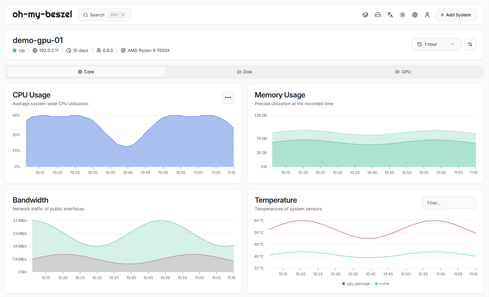
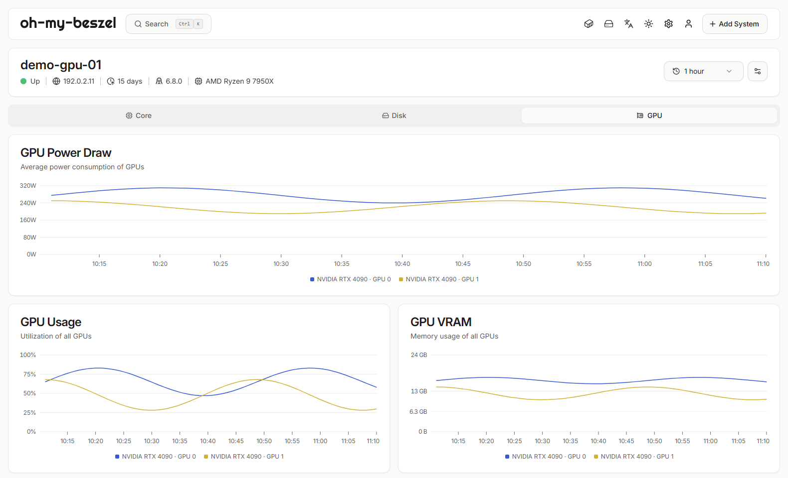
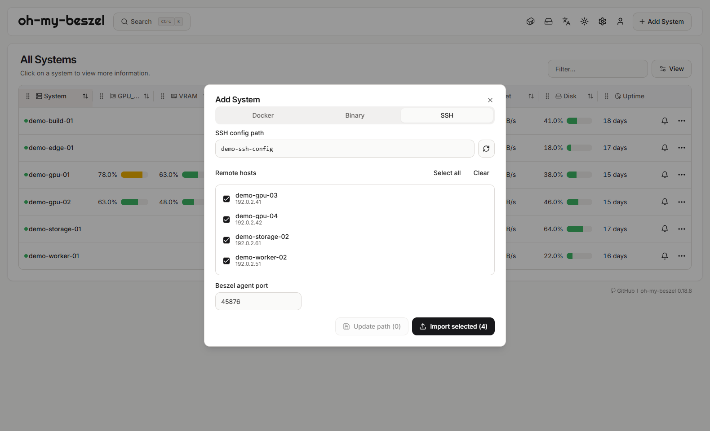

<p align="center">
  
</p>

<h1 align="center">oh-my-beszel</h1>
<p align="center">Know your GPU cluster. Manage it over SSH.</p>
<p align="center"><strong>English</strong> · <a href="README-CN.md">简体中文</a></p>
<p align="center"><a href="#features">Features</a> · <a href="#screenshots">Screenshots</a> · <a href="#quick-start">Quick start</a> · <a href="docs/guide.md">Documentation</a></p>

Lightweight, self-hosted monitoring for GPU labs and private clusters. **oh-my-beszel** brings multi-GPU visibility, SSH host import, and Agent deployment into one dashboard. An independently maintained, unofficial fork of [Beszel](https://github.com/henrygd/beszel).

## Features

- 🔍 **Maximum free VRAM detection.** Monitor the most free VRAM available on any single GPU per server; get notified when it stays above your threshold.
- 🚀 **Batch SSH config import.** Import hosts from OpenSSH config with jump hosts and existing keys, then deploy Linux Agents from the dashboard.
- 📊 **Multi-GPU monitoring.** Track utilization, VRAM, and temperature, with aggregate and per-GPU history plus CPU I/O wait and steal time alerts.
- 🎨 **Make the overview yours.** Reorder and hide columns, switch themes, and check your cluster on mobile.

Includes Beszel's system history, Docker / Podman monitoring, multi-user access, OAuth / OIDC, and backups.

## Screenshots

Isolated demo instance with synthetic hosts and metrics. The shared home screenshots show Chinese; the detail pages below use English.

**Cluster overview**


**Server details**



<details>
<summary>Multi-GPU charts, SSH management, and dark theme</summary>

**Multi-GPU history**



**SSH host management**



**Dark overview**


</details>

<details>
<summary>Mobile overview</summary>


</details>

## Quick start

Run one **Hub** for the dashboard and an **Agent** on each monitored node. Use builds from this repository to get the fork's features; upstream binaries and images do not include them.

**Already have a `build/` directory?** It is not tracked in git, but a release package or an earlier build may already contain ready-to-run binaries. If `build/windows/app/beszel.exe` and `build/windows/Monitor.exe` exist, skip the build commands below and start from the `config.json` step. macOS packages are staged under `build/macos/<arch>/`; Linux binaries use `build/linux/`. Verify the included checksums before running them. Binaries match the code as of their build date (`build-info.txt`); rebuild as shown below to pick up newer changes.

**Windows** · Requires Go 1.26.1+, Bun, and PowerShell 7. From the repository root:

```powershell
bun install --cwd ./internal/site --frozen-lockfile
bun run --cwd ./internal/site build
pwsh -NoLogo -NoProfile -File ./deploy/windows/build.ps1
```

In `build/windows/config.json`, set `hub.userEmail` and `hub.userPassword`, and clear `hub.autoLogin` for password login. Keep `host` at `127.0.0.1` for local access. These credentials initialize a new database; see the [Windows guide](docs/guide.md#windows) for existing accounts and inherited auto-login settings.

```powershell
Start-Process -FilePath ./build/windows/Monitor.exe
```

Open **http://127.0.0.1:8090** and sign in. The release itself has no PowerShell scripts or PowerShell runtime dependency. Use **Add System → SSH** to import nodes once the Hub's SSH access is ready.

**Change the web port:** edit `port` in `config.json` beside the running `Monitor.exe` (for example, `8091`), then restart the Hub and open `http://127.0.0.1:8091`. See [port and restart instructions](docs/guide.md#web-port).

**macOS** · Download the matching Release archive (`darwin_arm64` for Apple Silicon, `darwin_amd64` for Intel), extract it, and double-click **Open.command**. It installs under `~/Applications`, preserves existing configuration, enables login startup, and opens the dashboard after verifying startup. Create an account on the first visit. No Go, Bun, or Node.js is needed.

These steps require a new package containing `Open.command`. The unsigned download may require a one-time macOS approval; see the [quick-start manual](deploy/macos/package/README.txt). For daily use, open http://127.0.0.1:8090. For source builds and advanced configuration, see the [macOS guide](docs/guide.md#macos).

**Linux / WSL** · Follow the [build and startup guide](docs/guide.md#linux).

[SSH deployment](docs/guide.md#ssh) · [Manual Agent setup](docs/guide.md#manual-agent) · [macOS startup](docs/guide.md#macos) · [Windows launcher and auto-start](docs/guide.md#windows)

### Shared-host Agent port conflicts

If SSH deployment completes but the system immediately reports `ssh: unable to authenticate, attempted methods [none publickey]`, first check whether another user's Agent or a system service already owns the configured Agent port. Agent ports belong to the whole target host, so two users cannot both listen on the default `45876` address.

Use these steps for each affected target host:

1. Log in to the target with the same SSH alias used by the Hub, then test a candidate port. Replace `45878` with the port you want to use:

   ```bash
   PORT=45878
   if ss -ltnH "sport = :$PORT" | grep -q .; then
     echo "port $PORT is occupied"
   else
     echo "port $PORT is free"
   fi
   ```

   Choose a port reported as free. Check every target separately because a port that is free on one server may be occupied on another. Do not stop or replace another user's process.

2. Open the Hub dashboard and locate the affected system. Select its **three-dot menu → Edit**.
3. In the edit dialog, replace **Port** (`45876` by default) with the free port. Keep **Host / IP** unchanged and select **Save System**.
4. Saving changes the system to `pending`. For a system imported from an SSH config, the Hub automatically stops this SSH account's managed Agent, writes the new `LISTEN` port, starts it again, and reconnects through SSH. There is no separate redeploy button.
5. Wait for the system status to change to `up`, then confirm its charts update. If the new port is also occupied, choose another free port and repeat these steps; current auto-deployment reports the port conflict instead of treating the foreign listener as a successful deployment.

Automatic redeployment requires the system to retain its SSH config association. For a manually installed system without one, change the Agent's `LISTEN` value to the same new port and restart that Agent yourself before saving the matching **Port** in the Hub. See [SSH deployment troubleshooting](docs/guide.md#troubleshooting) for the full diagnosis.

### User-owned Agent directory

SSH auto-deployment installs the Agent without root access under one removable directory:

```text
~/oh-my-beszel/
├── bin/beszel-agent
├── config/env
├── config/hub_keys
├── data/
└── logs/
```

Multiple Hubs may share the same Agent: their public keys are stored one per line in `config/hub_keys`. To remove the SSH-installed Agent and its data, stop its user service first, then remove the service link and directory:

```bash
systemctl --user disable --now oh-my-beszel-agent.service 2>/dev/null || true
rm -f "$HOME/.config/systemd/user/oh-my-beszel-agent.service"
rm -rf "$HOME/oh-my-beszel"
systemctl --user daemon-reload 2>/dev/null || true
```

Removing `data/` also removes the Agent identity. See the [SSH deployment guide](docs/guide.md#ssh) for service and fallback behavior.

## Documentation and contributing

- [Configuration and operations](docs/guide.md) · [Troubleshooting](docs/guide.md#troubleshooting)
- [Upstream integration](docs/upstream-0.19.0.md): based on 0.18.8, with selected 0.19.0 changes.

Bug reports and pull requests are welcome on [GitHub](https://github.com/2018liuzhiyuan/oh-my-beszel/issues). Update both language versions when changing setup or behavior.

## Credits and license

Built on [Beszel](https://github.com/henrygd/beszel) and [PocketBase](https://pocketbase.io). Thanks to their authors and contributors. [MIT License](LICENSE).
